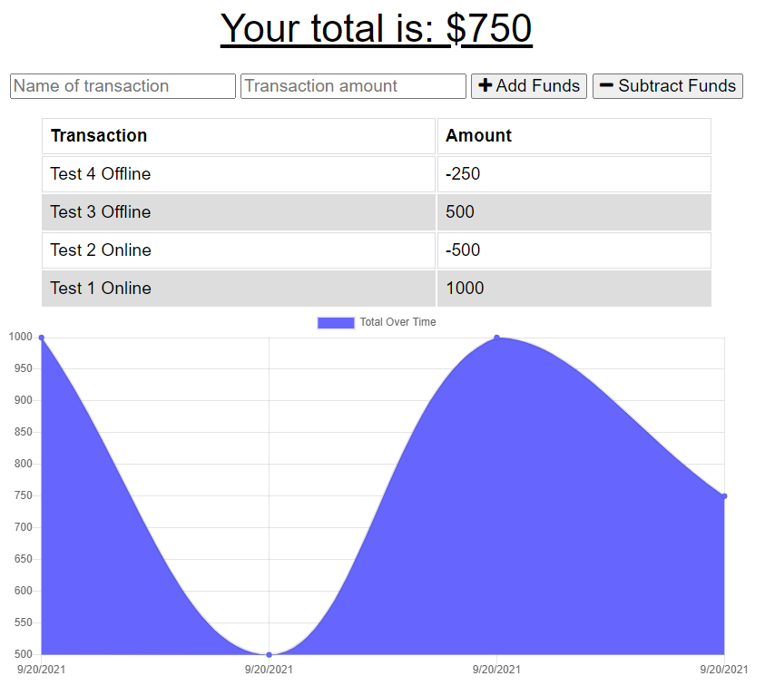

# budget-tracker
Challenge 19 U of A 

## Badge

## Description

A application that uses Indexdb to allow a budget tracker app to work offline when there is no internet connection. Once connected back to the internet the application will sink back up with the server. So no worry tracking your money anywhere you go.

## Table of Contents

- [Usage](#usage)
- [Installation](#installation)
- [Walkthrough](#walkthrough)
- [Languages](#languages)
- [Tests](#tests)
- [License](#license)
- [Credits](#credits)
- [Questions](#questions)

## Usage

Downloading the zip file from my github or forking the repo will allow you to use this code as a starting point for your own projects. You need to navigate to the command prompt and run NPI to get your package.json file and the addons needed.

## Installation
- npm i
- package.json Includes as follows
  - mongoose
  - express
  - heroku

 

## Walkthrough or Screenshot

## Langauges

- Javascript
- css
- html
- npm i

## Tests
None Applicable 

## License

Copyright (c) 2021

## Credits

- University of Arizona Ta,s and Tutors

## Questions

- Bryan Daniel 
    - GitHub [AZBDaniel](https://github.com/AZBDaniel)